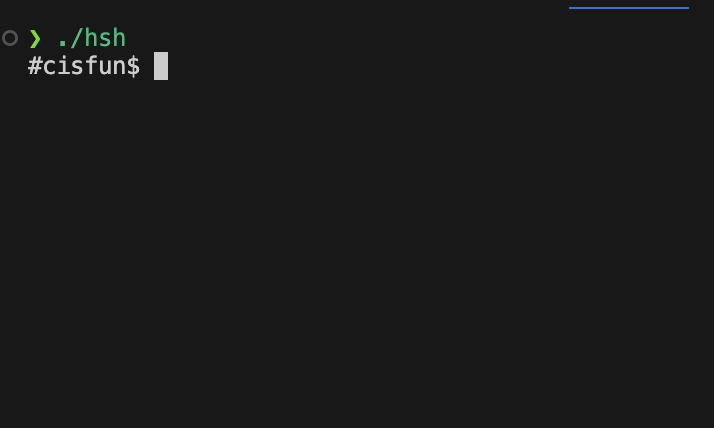
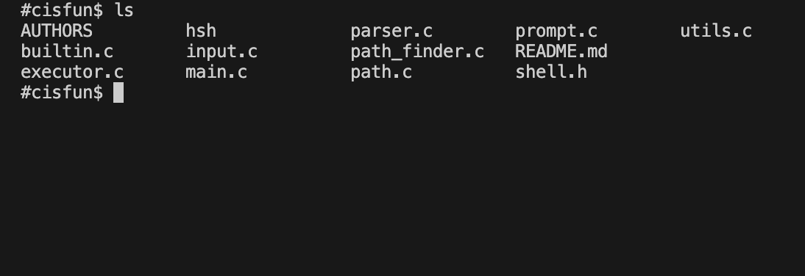
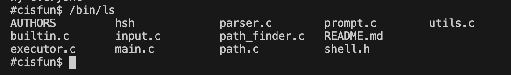
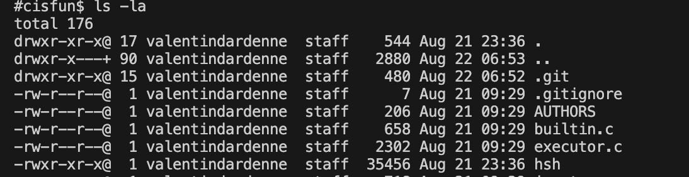
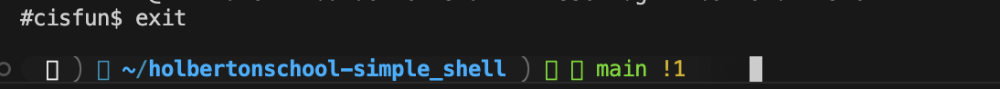

# 🐚 Simple Shell

**Simple Shell** is a minimalist UNIX command-line interpreter written in C.  
It provides a basic environment to execute system commands, similar to the standard `sh` shell.

---

## 📦 Installation

Follow these steps to set up the project locally.

### 1. Clone the repository
```bash
git clone https://github.com/ValentinDLC/holbertonschool-simple_shell.git
cd holbertonschool-simple_shell
```
### 2. Create and push your own branch
```bash
git checkout -b branch_name
git push --set-upstream origin branch_name
```
### 3. Compile the program
Standard compilation with the hsh executable:
```bash
gcc -Wall -Werror -Wextra -pedantic -std=gnu89 *.c -o hsh
```

### 4. Lauch the shell
Run the shell:
```bash
./hsh
```

## Manual  ```man page```

To consult the man page for the Simple Shell, you can use the man command

### 1. Save the man file as:
```bash
hsh.1
```

### 2.Execute command

```bash
man ./hsh.1
```

## 3. Requirements

- **Ubuntu 20.x** (development and testing environment)  
- **GCC** (GNU Compiler Collection) for compiling C code  
- **Git** for version control  
- **Standard C library functions**

## 4. Usage Examples

### Shell Execution


### Supported Commands

#### Basic commands


#### Absolute paths


#### Commands with arguments


#### Built-in commands


---

### To quit
Use **Ctrl+D** (EOF) or the **exit** command.